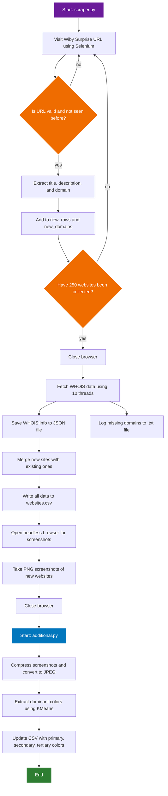

# Wiby websites list

I’ve always wanted to have a repository like this where I can explore the websites featured on [wiby.me](https://wiby.me/). Thanks to artificial intelligence, I was able to create small scripts that brought this idea to life.

---

## Made with

<p>
    
    
    
    
    
<p>

---

## Get Started

### Requirements

* Python 3.8 or higher
* Firefox browser
* pip for installing dependencies

### Installation

1. Clone the repository:

```bash
git clone https://github.com/plumkewe/wiby-websites-list.git
cd wiby-websites-list
```

2. Install the dependencies:

```bash
pip install python-whois tqdm selenium webdriver-manager pillow scikit-learn numpy
```

---

### Project Structure

```graphql
wiby-websites.list/
├── websites.csv                ← Main dataset: URL, title, description, domain, creation date, colors
├── index.html                  ← Homepage generated from `to-html.py`
├── scraper.py                  ← Scrapes Wiby links, fetches WHOIS, title, description, and stores data in CSV
├── additional.py               ← Compresses PNG screenshots and extracts dominant colors (KMeans)
├── to-html.py                  ← Converts the CSV data into a browsable HTML site
├── whois-data.json             ← Cached WHOIS data for discovered domains
├── missing_whois-data.txt      ← List of domains where WHOIS lookup failed
├── blacklisted.txt             ← List of domains to ignore during scraping
│
├── screenshots_to_optimize/    ← Raw PNG screenshots (pre-compression)
│   ├── 3030.png
│   ├── 3031.png
│   ├── 3033.png
│   └── ... (more screenshots)
│
├── screenshot_thumbnails/      ← Optimized JPEG thumbnails (compressed version of screenshots)
│   ├── 3011.jpg
│   ├── 193.jpg
│   └── ... (more thumbnails)
│
└── extra/                      ← Auxiliary files
    ├── color/                  ← Color analysis
    │   └── ... (optional files)
    ├── res/                    ← Additional site assets
    │   └── ... 
    └── screenshots_with_error/ ← Screenshots with errors
        ├── 3054.jpg
        ├── 3078.jpg
        ├── 2910.jpg
        └── ...
```

---


## Usage

1. Run the scraper:

```bash
python scraper.py
```

2. Optimize screenshots and extract colors:

```bash
python additional.py
```

3. Generate the static HTML website:

```bash
python to-html.py
```

The final output will be saved as `index.html`

---

## Workflow Overview of `scraper.py` and `additional.py`


---

### scraper.py

```python
import os
import csv
import json
import whois
from tqdm import tqdm
from urllib.parse import urlparse
from datetime import datetime
from selenium import webdriver
from selenium.webdriver.firefox.options import Options
from selenium.webdriver.firefox.service import Service
from selenium.webdriver.firefox.firefox_profile import FirefoxProfile
from selenium.webdriver.support.ui import WebDriverWait
from selenium.common.exceptions import (
TimeoutException,
UnexpectedAlertPresentException,
NoAlertPresentException
)
from webdriver_manager.firefox import GeckoDriverManager
import concurrent.futures
import time

# CONFIGURATION PARAMETERS
NUM_WEBSITES_TO_FIND = 250  # Number of websites to scrape
WEBSITES_CSV = "websites.csv"  # CSV file where websites info will be saved
WHOIS_JSON = "whois-data.json"  # JSON file to store WHOIS data
MISSING_WHOIS = "missing_whois-data.txt"  # Text file to track domains with failed WHOIS lookup
RAW_SCREENSHOT_DIR = "screenshots_to_optimize"  # Folder to save raw screenshots
SURPRISE_URL = "https://wiby.me/surprise/"  # URL to get random websites from
BLACKLIST_FILE = "blacklisted.txt"  # File with blacklisted domains (ignored by scraper)

# LOAD BLACKLIST IF EXISTS
if os.path.exists(BLACKLIST_FILE):
with open(BLACKLIST_FILE, 'r', encoding='utf-8') as f:
blacklist = set(line.strip() for line in f if line.strip())
else:
blacklist = set()

# HELPER FUNCTION TO HANDLE ALERTS AND PAGE LOAD TIMEOUTS SAFELY
def safe_get(driver, url):
try:
driver.get(url)  # Try to open the page
except (UnexpectedAlertPresentException, TimeoutException):
# If alert or timeout occurs, try to accept alert and reload page once
try:
alert = driver.switch_to.alert
alert.accept()
except NoAlertPresentException:
pass
time.sleep(1)
try:
driver.get(url)
except Exception:
pass

# HELPER FUNCTION TO WAIT FOR URL TO CHANGE WITH ALERT HANDLING
def safe_wait_for_url_change(driver, original_url, timeout=4):
end = time.time() + timeout
while time.time() < end:
try:
if driver.current_url != original_url:  # Check if URL has changed
return
except UnexpectedAlertPresentException:
try:
driver.switch_to.alert.accept()  # Accept any alert if present
except NoAlertPresentException:
pass
time.sleep(0.1)
raise TimeoutException(f"URL did not change from {original_url!r} within {timeout}s")

# FIREFOX BROWSER INITIALIZATION WITH CUSTOM PROFILE TO SPEED UP SCRAPING
profile = FirefoxProfile()
# Disable loading images, stylesheets, fonts and plugins to speed up loading
profile.set_preference("permissions.default.image", 2)
profile.set_preference("permissions.default.stylesheet", 2)
profile.set_preference("permissions.default.fonts", 2)
profile.set_preference("media.autoplay.default", 5)
profile.set_preference("dom.ipc.plugins.enabled", False)
profile.set_preference("network.http.use-cache", False)
profile.set_preference("browser.cache.disk.enable", False)
profile.set_preference("browser.cache.memory.enable", False)
profile.set_preference("javascript.enabled", True)  # Keep JS enabled for dynamic content

options = Options()
options.headless = True  # Run Firefox in headless mode (no GUI)
options.profile = profile

# Setup WebDriver using GeckoDriverManager to automatically handle driver installation
service = Service(GeckoDriverManager().install())
driver = webdriver.Firefox(service=service, options=options)
driver.set_page_load_timeout(4)  # Timeout for page loading
driver.set_window_size(1280, 720)  # Set window size for screenshots
wait = WebDriverWait(driver, timeout=3)

# CREATE DIRECTORY FOR RAW SCREENSHOTS IF NOT EXISTS
os.makedirs(RAW_SCREENSHOT_DIR, exist_ok=True)

# LOAD EXISTING WEBSITES FROM CSV TO AVOID DUPLICATES
if os.path.exists(WEBSITES_CSV):
with open(WEBSITES_CSV, newline='', encoding='utf-8') as f:
reader = csv.DictReader(f, delimiter=';')
siti_esistenti = list(reader)
else:
siti_esistenti = []

# TRACK ALREADY VISITED URLS AND DETERMINE NEXT INDEX
urls_gia_visti = set(row['url'] for row in siti_esistenti)
prossimo_index = max([int(r['index']) for r in siti_esistenti], default=0) + 1

nuovi_rows = []  # To store newly found websites data
nuovi_domini = []  # To store newly found domains

# MAIN LOOP TO SCRAPE RANDOM WEBSITES UNTIL DESIRED NUMBER IS REACHED
with tqdm(total=NUM_WEBSITES_TO_FIND, desc="Searching") as pbar:
while len(nuovi_rows) < NUM_WEBSITES_TO_FIND:
safe_get(driver, SURPRISE_URL)  # Load the surprise/random URL
try:
safe_wait_for_url_change(driver, SURPRISE_URL, timeout=4)  # Wait for redirect to actual site
url = driver.current_url
# Skip system/internal URLs (e.g., about:) but do NOT skip blacklisted ones
if url.startswith("about:"):
continue

# Extract domain from URL (removing www.)
domain = urlparse(url).netloc.replace("www.", "").lower()

# Skip URLs already seen, except if domain is blacklisted (override)
if url in urls_gia_visti and domain not in blacklist:
continue

# Try to get page title safely
try:
title = driver.title.strip()
except:
title = ''

# Try to extract meta description if present
try:
description = driver.find_element("xpath", '//meta[@name="description"]').get_attribute("content") or ''
except:
description = ''

# Create row dictionary for the current site
row = {
'index': str(prossimo_index),
'url': url,
'title': title,
'description': description,
'domain': domain,
'creation_date': ''  # Will be filled later via WHOIS
}
nuovi_rows.append(row)
urls_gia_visti.add(url)
nuovi_domini.append(domain)
prossimo_index += 1
pbar.update(1)  # Update progress bar
except TimeoutException:
continue  # On timeout, just retry

driver.quit()  # Close browser after scraping URLs

# FUNCTION TO FETCH WHOIS INFORMATION FOR A DOMAIN
def fetch_whois(row):
domain = row['domain']
try:
info = whois.whois(domain)
creation = info.creation_date
# WHOIS creation_date can be list, string, or datetime, normalize it
if isinstance(creation, list):
creation = creation[0]
if isinstance(creation, str):
row['creation_date'] = creation[:10]  # Keep only date part YYYY-MM-DD
elif isinstance(creation, datetime):
row['creation_date'] = creation.date().isoformat()
else:
row['creation_date'] = ''
# Return tuple with domain, whois info, and no error
return (domain, info if isinstance(info, dict) else info.__dict__, None)
except Exception:
# On error, return error flag
return (domain, None, "error")

whois_results = {}
missing_domains = []

# FETCH WHOIS DATA USING MULTI-THREADING TO SPEED UP
with concurrent.futures.ThreadPoolExecutor(max_workers=10) as executor:
futures = [executor.submit(fetch_whois, row) for row in nuovi_rows]
for future in tqdm(concurrent.futures.as_completed(futures), total=len(futures), desc="WHOIS"):
domain, info, error = future.result()
if info:
whois_results[domain] = info
if error:
missing_domains.append(domain)

# LOAD EXISTING WHOIS DATA FROM JSON AND UPDATE IT WITH NEW RESULTS
if os.path.exists(WHOIS_JSON):
with open(WHOIS_JSON, 'r', encoding='utf-8') as f:
existing_whois = json.load(f)
else:
existing_whois = {}

# Merge new WHOIS data only for new domains
existing_whois.update({k: v for k, v in whois_results.items() if k not in existing_whois})

# SAVE UPDATED WHOIS DATA TO JSON FILE
with open(WHOIS_JSON, 'w', encoding='utf-8') as f:
json.dump(existing_whois, f, indent=2, default=str)

# LOAD AND UPDATE LIST OF DOMAINS THAT FAILED WHOIS LOOKUP
if os.path.exists(MISSING_WHOIS):
with open(MISSING_WHOIS, 'r', encoding='utf-8') as f:
existing_missing = set(line.strip() for line in f if line.strip())
else:
existing_missing = set()

updated_missing = existing_missing.union(missing_domains)

with open(MISSING_WHOIS, 'w', encoding='utf-8') as f:
for d in sorted(updated_missing):
f.write(d + "\n")

# SAVE ALL WEBSITES DATA INCLUDING EXISTING AND NEW ONES INTO CSV
fieldnames = ['index', 'url', 'title', 'description', 'domain', 'creation_date', 'primary', 'secondary', 'tertiary']
with open(WEBSITES_CSV, 'w', newline='', encoding='utf-8') as f:
writer = csv.DictWriter(f, fieldnames=fieldnames, delimiter=';')
writer.writeheader()
for row in siti_esistenti + nuovi_rows:
# Ensure all expected fields exist, fill missing ones with empty string
complete_row = {key: row.get(key, '') for key in fieldnames}
writer.writerow(complete_row)

# REINITIALIZE FIREFOX DRIVER FOR TAKING SCREENSHOTS
options = Options()
options.headless = True
driver = webdriver.Firefox(service=service, options=options)
driver.set_page_load_timeout(4)
driver.set_window_size(1280, 720)

# TAKE RAW SCREENSHOTS FOR NEWLY FOUND WEBSITES
for row in tqdm(nuovi_rows, desc="Screenshot raw"):
url = row['url']
index = row['index']
try:
safe_get(driver, url)
try:
# Wait until page is fully loaded or timeout after 4 seconds
WebDriverWait(driver, 4).until(
lambda d: d.execute_script("return document.readyState") == "complete"
)
except TimeoutException:
pass
raw_path = os.path.join(RAW_SCREENSHOT_DIR, f"{index}.png")
driver.save_screenshot(raw_path)  # Save screenshot
except Exception:
continue  # Skip on any error

driver.quit()  # Close browser at the end
```

---

### additonal.py

```python
import os

# Limit CPU usage strictly before importing heavy libraries like numpy, sklearn, etc.
os.environ["OMP_NUM_THREADS"] = "1"
os.environ["OPENBLAS_NUM_THREADS"] = "1"
os.environ["MKL_NUM_THREADS"] = "1"
os.environ["VECLIB_MAXIMUM_THREADS"] = "1"
os.environ["NUMEXPR_NUM_THREADS"] = "1"

import csv
from PIL import Image, ImageFile
from collections import Counter
from sklearn.cluster import KMeans
import numpy as np
from tqdm import tqdm

# Allow loading of truncated images without errors
ImageFile.LOAD_TRUNCATED_IMAGES = True

# 📁 Configuration variables
RAW_SCREENSHOT_DIR = "screenshots_to_optimize"  # Folder with raw screenshots to compress
THUMBNAIL_DIR = "screenshot_thumbnails"         # Folder to save compressed thumbnails
QUALITY = 40                                    # JPEG quality for compression (0-100)
CSV_PATH = 'websites.csv'                       # CSV file with website data

# Create output directory if it doesn't exist
os.makedirs(THUMBNAIL_DIR, exist_ok=True)

# Function to compress a single image once with given quality
def compress_image_once(input_path, output_path, quality=QUALITY):
with Image.open(input_path) as img:
# Convert to RGB if image has transparency or palette
if img.mode in ("RGBA", "P"):
img = img.convert("RGB")
# Save image as optimized JPEG with specified quality
img.save(output_path, format='JPEG', optimize=True, quality=quality)

# Compress all images in RAW_SCREENSHOT_DIR and move to THUMBNAIL_DIR
def compress_and_move_images():
for fname in tqdm(os.listdir(RAW_SCREENSHOT_DIR), desc="Compressing"):
raw_path = os.path.join(RAW_SCREENSHOT_DIR, fname)
if not os.path.isfile(raw_path):
continue  # Skip if not a file (e.g. directories)

name, _ = os.path.splitext(fname)
thumb_path = os.path.join(THUMBNAIL_DIR, f"{name}.jpg")
try:
compress_image_once(raw_path, thumb_path)
os.remove(raw_path)  # Remove original raw image after compression
except Exception as e:
print(f"Errore su {fname}: {e}")
continue

# Extract dominant colors from an image using KMeans clustering
def get_dominant_colors(image_path, num_colors=3):
try:
image = Image.open(image_path).convert('RGB')
# Resize to speed up clustering, keeping 150x150 pixels
image = image.resize((150, 150))
pixels = np.array(image).reshape(-1, 3)  # Flatten pixel array to (N,3)

unique_colors = np.unique(pixels, axis=0)
n_clusters = min(num_colors, len(unique_colors))  # Avoid more clusters than unique colors
if n_clusters == 0:
return []

# Perform KMeans clustering to find dominant colors
kmeans = KMeans(n_clusters=n_clusters, random_state=42, n_init=1)
kmeans.fit(pixels)

counts = Counter(kmeans.labels_)  # Count how many pixels belong to each cluster
centroids = kmeans.cluster_centers_  # RGB values of cluster centers
# Sort colors by cluster size descending (most dominant first)
sorted_colors = [centroids[i] for i, _ in counts.most_common(n_clusters)]
sorted_colors = [tuple(map(int, color)) for color in sorted_colors]

# If less than requested colors found, pad with empty tuples
while len(sorted_colors) < num_colors:
sorted_colors.append(())

return sorted_colors
except Exception as e:
print(f"Error con {image_path}: {e}")
return []

# Update CSV file in-place by adding dominant colors columns if missing or empty
def update_csv_with_colors(csv_path=CSV_PATH, images_dir=THUMBNAIL_DIR):
# Load CSV rows into memory
with open(csv_path, 'r', encoding='utf-8') as f:
reader = csv.DictReader(f, delimiter=';')
rows = list(reader)
fieldnames = reader.fieldnames.copy()

# Ensure primary, secondary, tertiary columns exist
for col in ['primary', 'secondary', 'tertiary']:
if col not in fieldnames:
fieldnames.append(col)

# Iterate rows and update color columns if empty
for row in tqdm(rows, desc="Updating .csv"):
index = row.get('index')
if not index:
continue

# Skip if all three color fields are already filled
already_filled = all(row.get(col, "").strip() for col in ['primary', 'secondary', 'tertiary'])
if already_filled:
continue

img_path = os.path.join(images_dir, f"{index}.jpg")
if os.path.exists(img_path):
colors = get_dominant_colors(img_path)
# Convert color tuples to strings, empty string if no color found
row['primary'] = str(colors[0]) if colors[0] else ''
row['secondary'] = str(colors[1]) if colors[1] else ''
row['tertiary'] = str(colors[2]) if colors[2] else ''
else:
row['primary'] = row['secondary'] = row['tertiary'] = ''

# Overwrite CSV with updated rows and new columns
with open(csv_path, 'w', encoding='utf-8', newline='') as f:
writer = csv.DictWriter(f, fieldnames=fieldnames, delimiter=';')
writer.writeheader()
writer.writerows(rows)

print("Done!")

if __name__ == "__main__":
compress_and_move_images()   # Compress all raw screenshots and move them to thumbnails folder
update_csv_with_colors()     # Extract dominant colors from thumbnails and update CSV accordingly
```

---

#### Known issues

The `scraper.py` script may occasionally encounter errors while scraping websites, which can cause it to lose progress and stop unexpectedly. Because of this, it is not recommended to set `NUM_WEBSITES_TO_FIND` to very high values, as doing so might lead to wasted time if the script fails before completing the target number of sites.